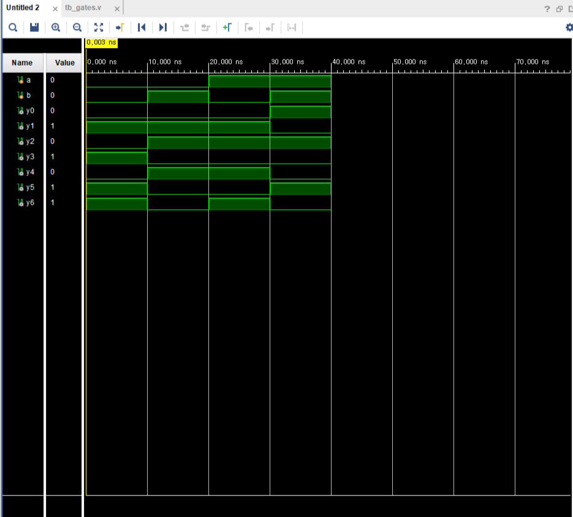

# gates

## 목표

베릴로그의 논리 연산자와 assign문을 이해하고 모든 gate의 동작을 보드에 프로그래밍한다.

## 개발환경

- Vivado 2020.2

## 디렉터리

- src/
    - gates.v
- tb/
    - tb_gates.v
- constraints/
    - gates.xdc
- images/
    - schematic.png
    - wave_form.png
- docs/
                           
## 동작

- 1 bit input a, b에 대해 각 게이트의 결과를 출력한다.
    - y0: a and b
    - y1: a nand b
    - y2: a or b
    - y3: a nor b
    - y4: a xor b
    - y5: a xnor b
    - y6: not b

## Simulation



## 배운 점

- wire는 하드웨어적으로 실제 구리선. 이어지면 끝이라 재할당이 불가하며 값 저장 없이 연결만 한다.
    - 보통 시뮬레이션할 때 output에 사용된다.

- reg는 레지스터로 값 저장을 하며 재할당도 가능하다. 

- assign은 물리적으로 연결된 선이다. 따라서 입력에 대해 동시에 작동한다.

- 논리연산자
```Verilog
// and
assign y0 = a & b;

// nand
assign y1 = ~ ( a & b );

// or
assign y2 = a | b;

// nor
assign y3 = ~ ( a | b );

// xor
assign y4 = a ^ b;

// xnor
assign y5 = ~ ( a ^ b );
assign y5 = a ~^ b;

// not
assign y6 = ~b;
```

- Top module: 최상위 모듈
    - 다른 서브모듈들을 인스턴스로 가져와 사용하고 연결하고 제어한다.
    - top module만 외부에서 물리적인 입력과 출력을 직접 주고받으며 통신할 수 있다.
        - 서브모듈들은 top 모듈을 통해서만 외부와 통신 가능